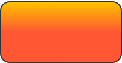
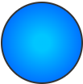
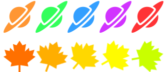
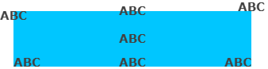

# DrawableJS

[](https://github.com/jaianper/drawable-js/releases)
[](https://www.npmjs.com/package/drawable-js)
[](https://www.npmjs.com/package/drawable-js)
[](LICENSE)

[](https://eslint.org/)
[](https://github.com/jaianper/drawable-js/actions/workflows/ci.yml)

**DrawableJS** is a lightweight JavaScript library to draw shapes, gradients, styled text, and more on HTML5 `<canvas>`. It is inspired by Android's `Drawable` resource, but designed for the modern web.

## Features
- Draw basic shapes: rectangles, ovals, lines and images.
- Support for solid colors and gradients (linear and radial).
- Option to set borders, rounded corners, and shadows.
- Render text with font and alignment options.
- Extendable structure: each shape can include extra content.
- Compatible with both ES Modules and classic script tags (UMD).
- Inspired by Android’s `Drawable` and `Canvas` system.

## Installation

Install via `npm`:
```bash
npm install drawable-js
```

Or include directly in the browser (UMD version):
```html
<script src="dist/drawable.umd.js"></script>
```

## Usage

### With ES Modules
Draw a Rectangle with Linear Gradient:
```js
import { Drawable, Shape, Gradient } from 'drawable-js';

const canvas = document.getElementById("myCanvas");
const ctx = canvas.getContext("2d");

const rect = new Drawable(200, 100);
rect.ctx = ctx;
rect.update = () => {
    rect.items = [
    {
        shape: Shape.RECTANGLE,
        x: 20,
        y: 20,
        width: 200,
        height: 100,
        gradient: {
            type: Gradient.LINEAR_GRADIENT,
            angle: 45,
            center: { x: '50%', y: '50%' },
            startColor: "#FF5733",
            endColor: "#FFC300"
        },
        stroke: {
            color: "#333333",
            width: 2
        },
        cornerRadius: [15, 15, 15, 15]
    }
    ];
};
rect.build();
```

Result:



Draw a Circle with Radial Gradient:
```js
import { Drawable, Shape, Gradient } from 'drawable-js';

const canvas = document.getElementById("myCanvas");
const ctx = canvas.getContext("2d");

const circle = new Drawable(100, 100);
circle.ctx = ctx;
circle.update = () => {
    circle.items = [
        {
            shape: Shape.OVAL,
            x: 300,
            y: 150,
            radius: 50,
            gradient: {
                type: Gradient.RADIAL_GRADIENT,
                center1: { x: 300, y: 150 },
                radius1: 10,
                center2: { x: 300, y: 150 },
                radius2: 50,
                startColor: "#00c6ff",
                endColor: "#0072ff"
            },
            stroke: {
                color: "#333333",
                width: 2
            }
        }
    ];
};
circle.build();
```

Result:



### With UMD in Browser
Draw a Rectangle with Linear Gradient:
```html
<script src="dist/drawable.umd.js"></script>
<script>
  const canvas = document.getElementById("myCanvas");
  const ctx = canvas.getContext("2d");

  const rect = new DrawableJS.Drawable(200, 100);
  rect.ctx = ctx;
  rect.update = () => {
      rect.items = [
      {
          shape: DrawableJS.Shape.RECTANGLE,
          x: 20,
          y: 20,
          width: 200,
          height: 100,
          gradient: {
              type: DrawableJS.Gradient.LINEAR_GRADIENT,
              angle: 45,
              center: { x: '50%', y: '50%' },
              startColor: "#FF5733",
              endColor: "#FFC300"
          },
          stroke: {
              color: "#333333",
              width: 2
          },
          cornerRadius: [15, 15, 15, 15]
      }
      ];
  };
  rect.build();
</script>
```

Result:


Draw a Circle with Radial Gradient:
```html
<script src="dist/drawable.umd.js"></script>
<script>
  const canvas = document.getElementById("myCanvas");
  const ctx = canvas.getContext("2d");

  const circle = new DrawableJS.Drawable(100, 100);
  circle.ctx = ctx;
  circle.update = () => {
      circle.items = [
          {
              shape: DrawableJS.Shape.OVAL,
              x: 300,
              y: 150,
              radius: 50,
              gradient: {
                  type: DrawableJS.Gradient.RADIAL_GRADIENT,
                  center1: { x: 300, y: 150 },
                  radius1: 10,
                  center2: { x: 300, y: 150 },
                  radius2: 50,
                  startColor: "#00c6ff",
                  endColor: "#0072ff"
              },
              stroke: {
                  color: "#333333",
                  width: 2
              }
          }
      ];
  };
  circle.build();
</script>
```

Result:


## Fonts
You can preload fonts into the Canvas using `FontLoader.load`:

```js
import { FontLoader, Font } from 'drawable-js';

FontLoader.load({
  families: [Font.ARIAL],
  active: () => {
    console.log("Fonts ready!");
  }
});
```

## Demos
You can explore working examples in the `/demo` folder:
- `demo/esm/drawable-demo.html`: for modern projects using `<script type="module">`
- `demo/umd/drawable-demo.html`: for legacy support using UMD script

Run locally:
```bash
npm run dev
```
Then open one of the demo pages in your browser.

### Examples in the demo

Color filter in images:



Text position:



Animations:


## Development
Build the library before testing:
```bash
npm run build
```

## Inspiration
This system is inspired by the Android `Drawable` class. It's made to help developers who are familiar with Android work easily on drawing and graphic design projects in the web environment.

## License
DrawableJS is now released under the **MIT License**.

This change allows for more flexibility in how the library can be used, both in open-source and proprietary software.

For more details, see the [LICENSE](./LICENSE) file or visit: https://opensource.org/licenses/MIT

**Note:** Previous versions released under the GPLv3 license remain under that license.

## Author
Created by [jaianper](https://github.com/jaianper). Feel free to contribute or suggest improvements!
